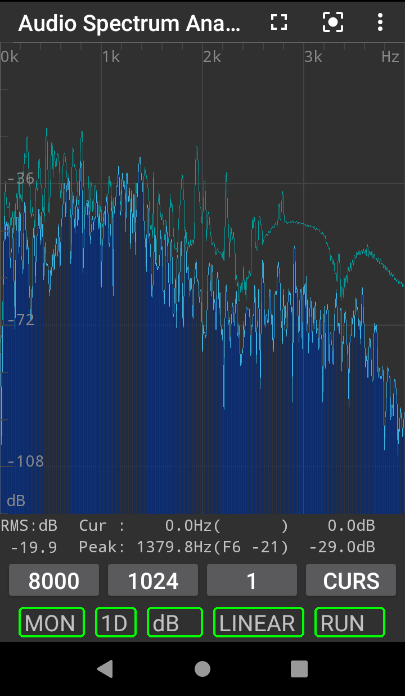
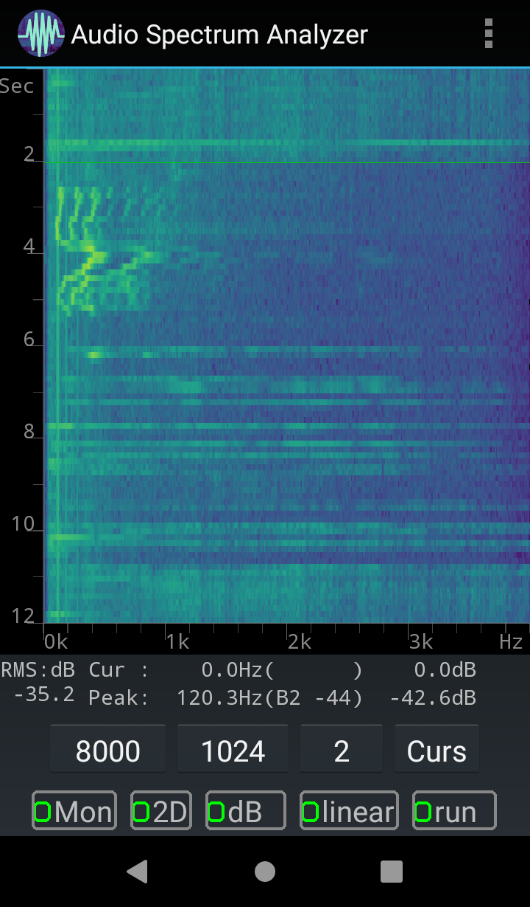

Audio Spectrum Analyzer for Android
===================================

>  A fork of [Audio spectrum Analyzer for Android](https://code.google.com/p/audio-analyzer-for-android/) (See README.old for its original readme)

  This software shows the frequency components' magnitude distribution (called spectrum) of the sound heard by your cell phone. Can be used to help tuning musical instrument or tone in singing, (tentative) measure environmental noise and sound revent education or experiments.

    

  

Features
--------

* Show [spectrum](http://en.wikipedia.org/wiki/Frequency_spectrum) or [spectrogram](http://en.wikipedia.org/wiki/Spectrogram) in real-time, with decent axis labels.
* Linear, Logarithm and (Musical) Note frequency axis support.
* You can put a cursor in the plot, for measurement or as a marker.
* Easy gestures to fine exam the spectrum: i.e. pinch for scaling and swipe for  view move.
* Show peak frequency in a moderate accuracy (FFT + interpolation).
* Show dB or [A-weighting dB (dBA)](http://en.wikipedia.org/wiki/A-weighting), although not suitable for serious application.
* Possible to take averages of several spectrum then plot, make the spectrum smoother.
* You may record the sound (while analyzing!) to a WAV file (PCM format). Then you can deal with it with your favorite tool.
* Support all recorder sources except those need root privilege (see list in Android reference: [MediaRecorder.AudioSource](http://developer.android.com/reference/android/media/MediaRecorder.AudioSource.html))
* Support all possible sampling rates that your phone is capable. e.g. useful to find out the native (or best) sampling format for you phone.

Permissions
-------------------------

* Microphone, of course.
* External storage (e.g MicroSD card), if you want to record the sound.

License
--------

This software, [Audio Spectrum Analyzer for Android](https://github.com/woheller69/audio_analyzer_for_android), is released under the Apache License, Version 2.0.

Copyright @thinkingcow, @bewantbe, @woheller69 

Code structure
--------------

The whole program structure is roughly follows the MVC model: 

_AnalyzerActivity.java_ is the controler, as the main activity, it receives user inputs and system events, then sent corresponding commands to views or sampling and analyzing procedures.

_AnalyzerViews.java_ is the view in MVC. It is used to manage (initialization, display, refresh) UI texts, buttons, dialogs and graphics.
_AnalyzerGraphic.java_ is a main sub-view which manage display of spectrum(_SpectrumPlot.java_) and spectrogram(_SpectrogramPlot.java_).

_SamplingLoop.java_ is more or less the "model" part. It performs the sampling and FFT analysis, and inform the graphics update.

#### Processing of audio samples
The data process loop is located in `run()` in _SamplingLoop.java_ (after commit c9e430b (Feb 06, 2017), but basicly this process didn't change since the initial commit), as well as the trigger of graphics refresh.

In every loop of `while (isRunning)`, it reads a chunk of audio samples by

    record.read(audioSamples, 0, readChunkSize);

, then "stream" it to `STFT.java` by

    stft.feedData(audioSamples, numOfReadShort);

which calculates RMS and FFT whenever enough data is collected. The view is then informed through

    activity.analyzerViews.update(spectrumDBcopy);

which ultimately calls `invalidate()` of the graphic view to request an update, then the `AnalyzerGraphic.onDraw(Canvas c)` will be called automatically.

